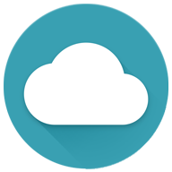
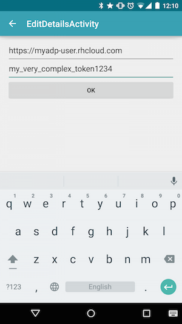
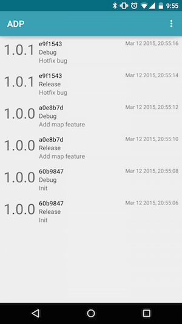

# Android Distribution Platform

Android Distribution Platform (ADP) is a fullstack framework for storing, distributing and installing versionized apk files based (mostly for internal team or roll-back purposes) on each CI git commit.



The developer can access easily from all devices a full precompiled list of the application's versions per git commit. This saves valuable compilation and installation time both in examining old application behaviour or distributing directly a version via a git commit.


## Technology behind

The logic is straightforward:
- A CI tool (Travis / Jenkins) compiles the desired version(s) and uploads the file(s) with a PUT command such as:
```bash
$ curl -X PUT https://myadp.rhcloud.com/upload -H "Api-Token: aaa" 
-F "f=@/app-debug.apk" -F "c=13c422d" -F "v=1.0" -F "b=productionRelease"
```
- The server saves the file in Amazon S3 (also for manual access)
- The app client lists the availiable apks or installs the desired apk using a token handshake

The backend is a [Python Flask](http://flask.pocoo.org) microframework able to run on a WSGI which supports [persistence objects](https://docs.python.org/2/library/shelve.html) (e.g. Openshift). Heroku is not supporting it.
An [Amazon S3 bucket](http://aws.amazon.com/s3/) is needed to store the apks.


## Instalation

Estimated installation time is <20 minutes.

It has 4 steps an requires basic knowledge to setup a server & CI tools.

#### 1. Amazon S3

First you need a S3 bucket, a AWS_KEY and the AWS_SECRET to use it remotely. Have the name and the tokens in hand to use them later. 

To see how to create a bucket see [here](http://docs.aws.amazon.com/AmazonS3/latest/gsg/CreatingABucket.html). To see how to obtain the Key and the Secret see [here](http://docs.aws.amazon.com/AWSSimpleQueueService/latest/SQSGettingStartedGuide/AWSCredentials.html).

#### 2. Backend

Download the backend code locally:
```bash
$ svn export https://github.com/Diolor/ADP/trunk/backend
```

In **config.cfg** file change the **AWS_KEY**, **AWS_SECRET**, **AWS_BUCKET** and **AWS_REGION** (if required) with the desired ones you have acquired above. Also change the **API_TOKEN** which is required to authenticate with the client app.

For S3 region codes see [here](http://docs.aws.amazon.com/general/latest/gr/rande.html#s3_region).

The code is ready to work with OpenShift's servers. You can use the awesome free gears that [RedHat's OpenShift servers](https://www.openshift.com) provide with ssl wrapping (create a simple python-2.7 gear). If you use OpenShift your server ip will look like: `https://myadp-user.rhcloud.com`.

Alternatively use your own python server/host.


#### 3. CI

First you need to expose the verion of your application in your CI tool. A simple way is the following snippet in gradle:

```gradle
apply plugin: 'com.android.application'

String VERSION_NAME = "1.0.0"

android {
    defaultConfig {
        versionName VERSION_NAME
    }
}

task version << {
    println VERSION_NAME
}
```
Running the above you can expose the version in the bash like: `./gradlew -q version`


An **example** of a Travis CI file is the following. Adjust the values as needed for your project. This will compile you and upload you 2 build variant apk files to the server:

```yml
language: android
android:
  components:
    - build-tools-21.1.2
    - android-21

env:
  global:
    - ADP_TOKEN=my_very_complex_token1234

install:
  - export JAVA7_HOME="/usr/lib/jvm/java-7-oracle"
  - ./gradlew assembleDebug
  - ./gradlew assembleRelease
  - export APP_VERSION=`./gradlew -q version`

script:
  # maybe run some tests here  
  # upload to ADP
  - COMMIT_SHORT=${TRAVIS_COMMIT:0:7}
  - COMMIT_MESSAGE=$(git show -s --format=%B $TRAVIS_COMMIT | tr -d '\n')

  - >
    curl -X PUT https://myadp-user.rhcloud.com/upload
    -H "Api-Token: $ADP_TOKEN"
    -F f="@$TRAVIS_BUILD_DIR/app/app-debug.apk"
    -F v="$APP_VERSION"
    -F c="$COMMIT_SHORT"
    -F n="$COMMIT_MESSAGE"
    -F b=debug

  - >
    curl -X PUT https://myadp-user.rhcloud.com/upload
    -H "Api-Token: $ADP_TOKEN"
    -F f="@$TRAVIS_BUILD_DIR/app/app-release.apk"
    -F v="$APP_VERSION"
    -F c="$COMMIT_SHORT"
    -F n="$COMMIT_MESSAGE"
    -F b=release
```

The files should be uploaded to `http(s)://MY_SERVER_IP/upload`. The parameters are the following:
```
-F f="@pathto/file.apk"
-F v="the_version"
-F c="the_commit_id"
-F n="the_commit_message"   # optional field
-F b="the_relese_flavor"
```


#### 4. Client

You can install the latest client application from [Google Play](https://play.google.com/store/apps/details?id=com.lorentzos.adp).

By default the application asks for the base api endpoint of your server and the token you choose. Upon saving the preferences you will simply see the list of the availiable apks that you have stored. Simply click one and it will be downloaded automatically.

 


## Costs / alternatives

Assuming that your apk is 20MB and you upload two flavors it will cost you $1/1€ for 830 commits per month.
Alternative open source solution: [HockeyKit](https://github.com/bitstadium/HockeyKit)


## Developed by

* Dionysis Lorentzos - <diolorentzos@gmail.com>


## Licence

```
The MIT License (MIT)

Copyright (c) 2015 Dionysis Lorentzos

Permission is hereby granted, free of charge, to any person obtaining a copy
of this software and associated documentation files (the "Software"), to deal
in the Software without restriction, including without limitation the rights
to use, copy, modify, merge, publish, distribute, sublicense, and/or sell
copies of the Software, and to permit persons to whom the Software is
furnished to do so, subject to the following conditions:

The above copyright notice and this permission notice shall be included in all
copies or substantial portions of the Software.

THE SOFTWARE IS PROVIDED "AS IS", WITHOUT WARRANTY OF ANY KIND, EXPRESS OR
IMPLIED, INCLUDING BUT NOT LIMITED TO THE WARRANTIES OF MERCHANTABILITY,
FITNESS FOR A PARTICULAR PURPOSE AND NONINFRINGEMENT. IN NO EVENT SHALL THE
AUTHORS OR COPYRIGHT HOLDERS BE LIABLE FOR ANY CLAIM, DAMAGES OR OTHER
LIABILITY, WHETHER IN AN ACTION OF CONTRACT, TORT OR OTHERWISE, ARISING FROM,
OUT OF OR IN CONNECTION WITH THE SOFTWARE OR THE USE OR OTHER DEALINGS IN THE
SOFTWARE.
```

[](http://android-arsenal.com/details/1/1646)
